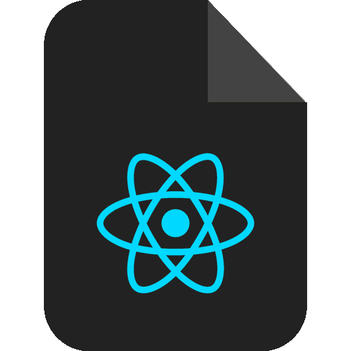
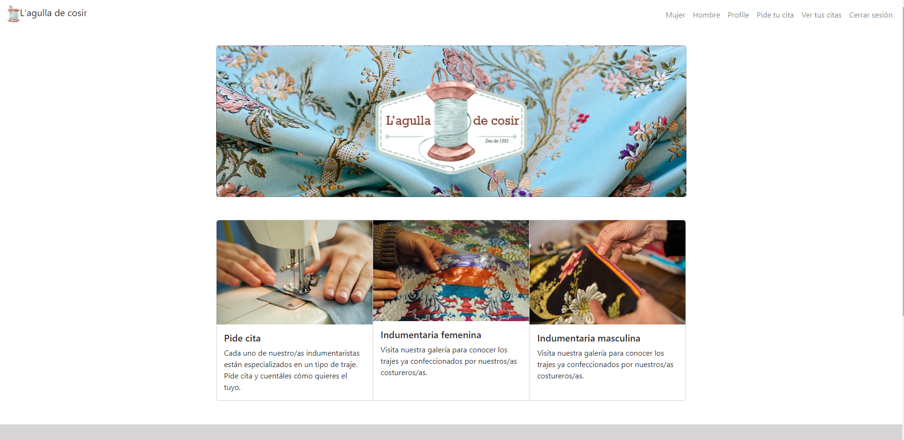
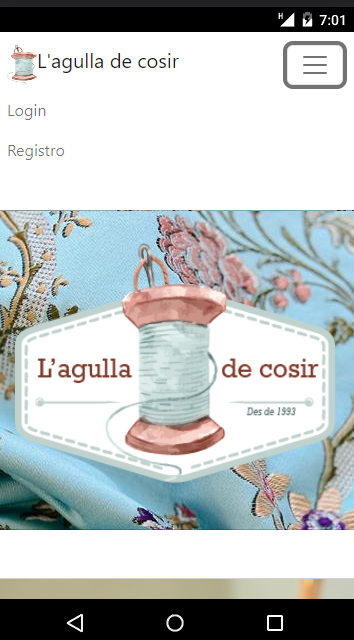
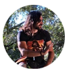

<h1 align="center"> Clínica-TrueSmile </h1>

<details>
  <summary>Contenido 📝</summary>
  <ol>
    <li><a href="#objetivo">Objetivo</a></li>
    <li><a href="#sobre-el-proyecto">Sobre el proyecto</a></li>
    <li><a href="#stack">Stack</a></li>
    <li><a href="#futuras-funcionalidades">Futuras funcionalidades</a></li>
    <li><a href="#licencia">Licencia</a></li>
    <li><a href="#webgrafia">Webgrafia</a></li>
    <li><a href="#desarrollo">Desarrollo</a></li>
    <li><a href="#agradecimientos">Agradecimientos</a></li>
    <li><a href="#contacto">Contacto</a></li>
  </ol>
</details>

## Objetivo 🎯
Este proyecto se conecta a una <a href="https://github.com/PaulaRibelles/back-web-L-agulla-de-cosir">base de datos</a> creada para gestionar las citas con una tienda de indumentaria valenciana.

## Sobre el proyecto 🔎
El proyecto consiste en crear una página web de una tienda especializada en indumentaria fallera, tanto femenina como masculina.
Lo que se pretende con este proyecto es que los clientes tengan la facilidad y comodidad de reservar cita con las y los indumentaristas en el momento que desee, sin tener que esperar a llamar por teléfono en horario comercial. 
  

## Stack :paperclip:

Tecnologías utilizadas:

<div>
<a href="https://react.dev/">
    
</a>

</a>
<a href="https://developer.mozilla.org/es/docs/Web/JavaScript">
    
</a>
 </div>

## Vistas :eyes:
 
<h4>Home</h4>

<h4>Home mobile</h4>


## Futuras funcionalidades :pencil:
<p>Actualizar y/o eliminar perfil </p>
<p>Admin poder crear, modificar y eliminar costureras </p>

## Contribuciones :mailbox:
Las sugerencias y aportaciones son siempre bienvenidas.  

Puedes hacerlo de dos maneras:

1. Abriendo una issue
2. Crea un fork del repositorio
    - Crea una nueva rama  
        ```
        $ git checkout -b feature/nombreUsuario-mejora
        ```
    - Haz un commit con tus cambios 
        ```
        $ git commit -m 'feat: mejora X cosa'
        ```
    - Haz push a la rama 
        ```
        $ git push origin feature/nombreUsuario-mejora
        ```
    - Abre una solicitud de Pull Request

## Licencia :scroll:
Este proyecto se encuentra bajo licencia de MIT License

## Webgrafia :books:
Para conseguir el objetivo hemos recopilado información de:

- <a href="https://react.dev/">React</a>

- <a href="https://react-bootstrap.github.io/">Bootstrap-React</a>

- <a href="https://stackoverflow.com">Stackoverflow</a>

## Agradecimientos :sparkles:

A Dani, profesor de GeeksHubs. Por estar siempre dispuesto ayudar (incluso días festivos).

<div>

- <a href="https://github.com/datata">Daniel Tarazona</a>
</div>

 A Ignacio, por responder siempre a mis llamadas y whatsapps. 

<div>

- <a href="https://github.com/IgnacioFurio">Ignacio Furió</a>
</div>


## Contacto :email:

· Paula Ribelles: ricam.paula@gmail.com